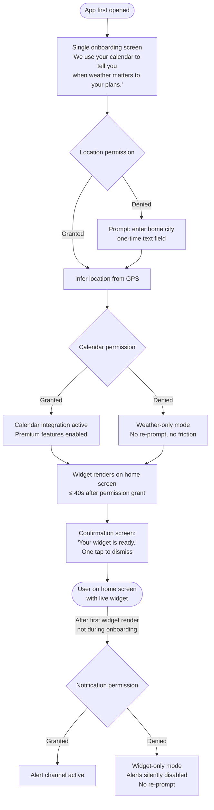
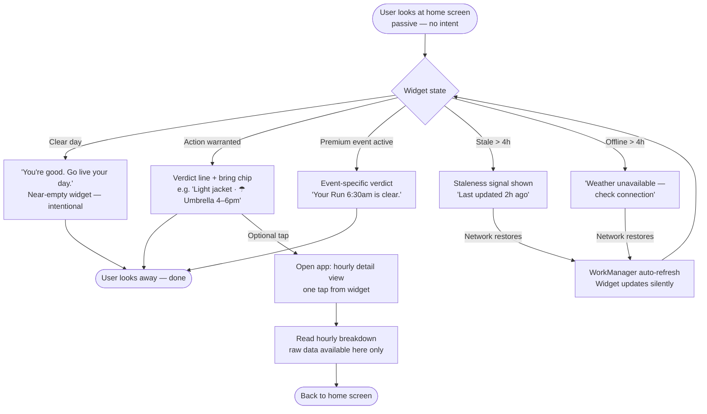
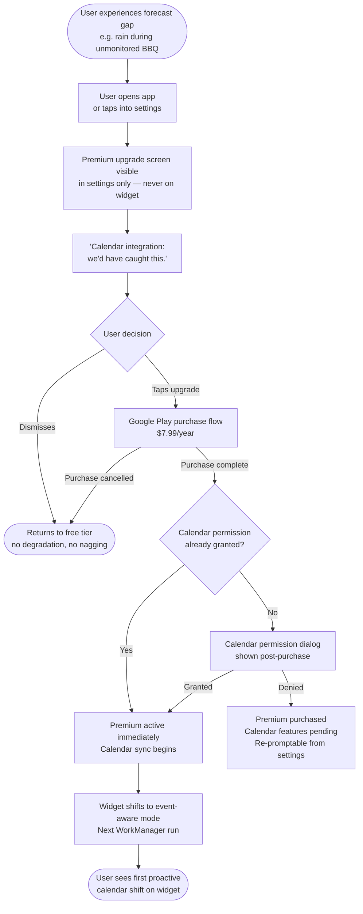
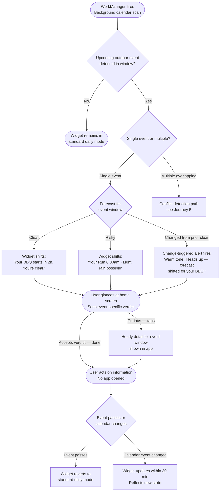
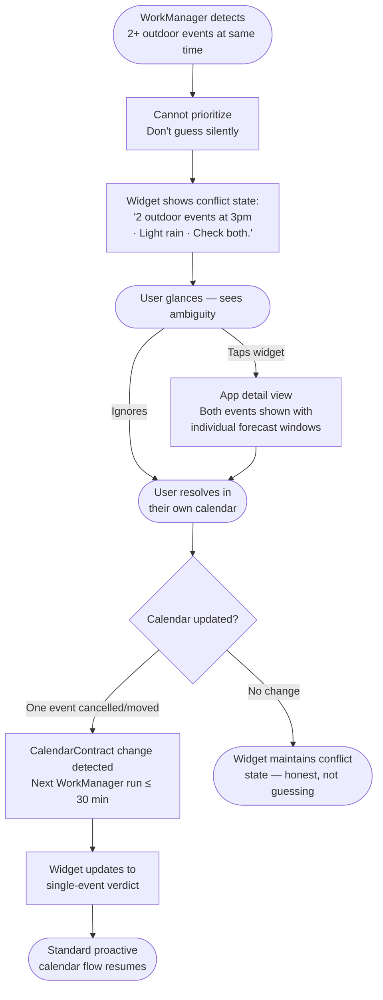
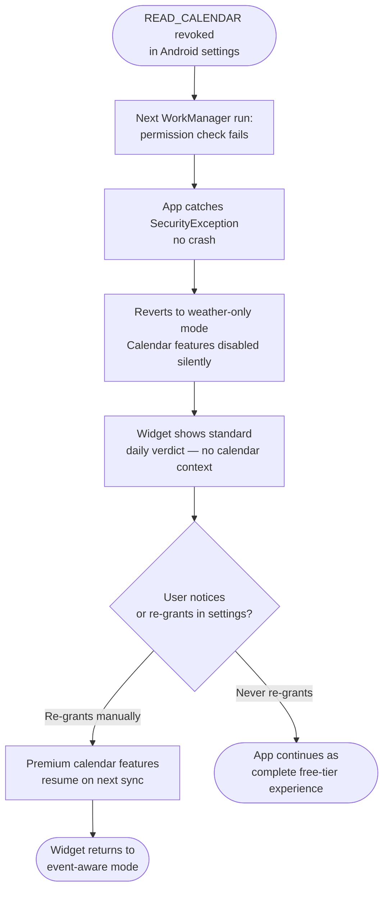

# UX Design Specification - WeatherApp

**Author:** Lafayette
**Date:** 2026-03-08

---

<!-- UX design content will be appended sequentially through collaborative workflow steps -->

## Executive Summary

### Project Vision

WeatherApp inverts the standard weather app model. Rather than presenting data for users to interpret, it reads the user's life — their calendar events, their plans — and delivers a verdict. The core job hired for: "will today surprise me badly?" answered in under 2 seconds, without the user doing any mental work. Weather is the input; the user's life is the interface.

The product is built around four non-negotiable design laws:
- **Zero ongoing effort** — the app reads, changes, and speaks silently
- **Adaptive ink** — the UI shrinks when there's nothing to say; silence is the message
- **Verdict before data** — the conclusion is always the primary surface
- **Confirmation-first alerts** — proactively confirm good news; escalate only on change

### Target Users

Five user archetypes define the full experience surface:

- **Amara** (habitual checker, free tier) — checks weather compulsively for reassurance. Mobile-first, glance-and-go. Trusts the widget after it's right three times in a row.
- **James** (weekend planner, free→premium) — converts when the free tier fails him in a specific, memorable moment. The paywall earns itself; no marketing required.
- **Elena** (power calendar user, premium) — complex overlapping outdoor events. Values transparency over confident-but-wrong answers. The edge case handler.
- **Lafayette** (solo operator) — maintainability is a UX constraint. The architecture must be debuggable by one person on a Sunday afternoon.
- **Priya** (permanent free user, word-of-mouth driver) — never upgrades, never complains, generates installs. The free tier must be genuinely complete for her.

Core trait across all users: **not weather enthusiasts**. They want weather handled so they can stop thinking about it.

### Key Design Challenges

1. **Trust through restraint** — The widget must earn trust by being right *and* by being quiet. An over-talkative widget or one that cries wolf on alerts destroys the core value prop. Designing "silence as a feature" is rare and counter-intuitive — most app instincts push toward more content, more engagement.

2. **Permission anxiety** — `READ_CALENDAR` is a sensitive permission. The onboarding must explain the value clearly enough to earn that grant in under 60 seconds, without feeling invasive or surveillance-adjacent.

3. **Ambiguity handling** — When the app doesn't know (conflicting calendar events, stale data, denied permissions), it must fail transparently — not silently, not confidently wrong. Elena's journey defines this requirement explicitly.

### Design Opportunities

1. **Widget voice as differentiator** — Lines like "Honestly lovely today. Eat lunch outside." are as much a design surface as the visual layout. The tone of the verdict is a competitive moat that visual copycats cannot replicate.

2. **The "how did it know?" moment** — The first proactive calendar-aware shift ("Your BBQ starts in 2h. You're clear.") is the premium conversion engine. Designing this moment to feel magical rather than creepy is the highest-leverage UX decision in the product.

3. **Silence as premium signal** — A near-empty widget on a clear day is the product working perfectly. Designing the all-clear state to feel confident rather than broken is an opportunity most weather apps miss entirely.

## Core User Experience

### Defining Experience

The defining experience of WeatherApp is the **zero-effort glance**. The user looks at their home screen widget, reads one line, and moves on. The product is functioning at its best when it is never opened — when the widget handled it.

The core interaction loop:
1. User glances at widget (not app)
2. Widget displays a verdict in plain language
3. User acts or doesn't act — no interpretation required
4. App has already updated for tomorrow

This inverts the standard weather app loop (open → parse data → interpret → decide). WeatherApp collapses steps 2–4 into a single pre-rendered verdict.

### Platform Strategy

- **Primary surface:** Android home screen widget — this is the product, not a promotional entry point
- **Secondary surface:** App config screen — the only place premium is mentioned; accessed deliberately, never pushed
- **Touch model:** Glance-first, tap optional. One tap from widget to hourly detail. No swipe-heavy navigation.
- **Offline:** Last cached forecast with staleness signal (< 4h), explicit unavailability message (≥ 4h). Widget never silently wrong.
- **Device capabilities leveraged:** CalendarContract (premium), WorkManager (background refresh), Android notification channels (confirmation-first alerts)
- **Permissions acquired sequentially:** Location (onboarding) → Calendar (onboarding) → Notifications (after first widget render). Never front-loaded.

### Effortless Interactions

| Interaction | How it becomes effortless |
|---|---|
| Knowing what to wear | Widget: never shown a temperature; shown a clothing verdict. Tap-through hourly view: temperature shown as a small secondary value alongside verdict language for users who want the data detail. |
| Knowing if plans are safe | Calendar events monitored silently; widget shifts before user checks |
| Deciding what to bring | Bring list appears only when warranted — not a permanent UI element |
| Understanding a bad forecast | App surfaces the specific concern; user doesn't have to find it |
| Getting back to the widget after a calendar change | Widget self-updates within 30 minutes; no user action required |

### Critical Success Moments

1. **Onboarding completion (≤ 60 seconds):** Calendar permission granted → live widget on home screen. If this takes longer or requires additional steps, trust is damaged before the product has a chance to earn it.
2. **The bring list hit (Day 3–5, free tier):** The first time the bring list saves the user from getting caught in rain. This is the moment the widget becomes trusted rather than tolerated.
3. **The proactive shift (Premium, first occurrence):** Widget shows event-specific weather before the user thinks to check. This is the conversion anchor — emotional, not logical.
4. **The all-clear (any day with good weather):** "You're good. Go live your day." must feel confident, not hollow. An empty widget that users trust is harder to design than a full one.
5. **Graceful ambiguity (Elena-type edge cases):** When the app doesn't know, it says so clearly. Trust is preserved through honesty, not false confidence.

### Experience Principles

1. **The widget is the product** — Every design decision is evaluated first at the widget level. App screens exist to configure, not to deliver value.
2. **Silence is information** — A minimal widget on a clear day is the product working correctly. Never add content to fill space; space is the message.
3. **Earn every word** — All copy — verdicts, bring list items, alerts — must be warranted by actual conditions. Nothing generic, nothing speculative.
4. **Fail honestly** — Ambiguity, stale data, and permission states are surfaced explicitly. The app never guesses silently or displays confidence it doesn't have.
5. **Premium is additive, never restorative** — The free tier is complete. Premium adds calendar intelligence on top of a fully functional experience. No features are withheld to manufacture upgrade pressure.

## Desired Emotional Response

### Primary Emotional Goals

**The emotional job:** Resolve anxiety before it becomes conscious. Users don't open the widget feeling curious — they open it carrying low-grade worry ("will today surprise me badly?"). The product succeeds when that worry dissolves in under 2 seconds, without effort.

**Emotional hierarchy:**

| Priority | Emotion | When it must be felt |
|---|---|---|
| 1 | **Relieved** | Every widget glance — the baseline |
| 2 | **Looked after** | Alerts, proactive shifts, bring list — "it handled it for me" |
| 3 | **Delighted** | The "how did it know?!" moment — premium conversion anchor |
| 4 | **Trusted** | Day 7+ — widget is the sole weather source, not cross-checked |

### Emotional Journey Mapping

| Stage | Target emotion | Design requirement |
|---|---|---|
| **Discovery** (first open) | Curious, not suspicious | Onboarding frame: "We use your calendar to tell you when weather matters to your plans." Clear, no jargon, no fine print energy. |
| **Onboarding** (60 seconds) | Confident, not anxious | One permission, one explanation, widget appears. Every additional step is an anxiety spike. |
| **First week (free)** | Cautiously trusting | Bring list hit on Day 3–5 converts skepticism to trust. The app must be right before it earns belief. |
| **Core daily use** | Calm, unhurried | Widget reads fast, requires nothing. No cognitive load carried forward. |
| **First proactive shift (premium)** | Genuinely surprised and delighted | "Your BBQ starts in 2h. You're clear." — this moment must feel magical, not algorithmic. |
| **Error / ambiguity states** | Respected, not deceived | Honest surfacing of uncertainty ("2 outdoor events at 3pm · Check both.") feels more trustworthy than a confident wrong answer. |
| **Return use** | Habitually settled | By week 2, opening the app is optional. The widget is woven into the morning routine. That settledness is the emotional goal of retention. |

### Micro-Emotions

**Confidence over confusion** — Clothing language ("light jacket weather") produces confidence; raw temperature (17°C) produces calculation. The product must eliminate calculation at every surface.

**Trust over skepticism** — The all-clear state ("You're good. Go live your day.") is the hardest emotional design challenge. A minimal widget on a clear day must feel settled, not broken or lazy. Trust is earned by being right on the hard days; it's tested on the quiet ones.

**Looked after over notified at** — The difference between a confirmation-first alert ("Still looks great for your run at 6:30am.") and a standard push notification is entirely emotional. Same information; completely different relationship.

**Surprise over expectation** — The first calendar-aware proactive shift must register as genuine surprise — "how did it know?" not "oh, it used my calendar." This requires the moment to precede the user's conscious thought, not respond to it.

### Design Implications

| Target emotion | UX design approach |
|---|---|
| **Relieved** | Verdict is always the first visual element. No data to parse before reaching the conclusion. |
| **Looked after** | Alerts are confirmations, not warnings by default. Good news first; changes escalated only when warranted. |
| **Delighted** | Widget copy has a voice — "Honestly lovely today. Eat lunch outside." is irreplaceable by data. Copy is a design surface. |
| **Trusted** | All-clear state is distinct and confident — not minimal by accident but minimal by design. Silence means "clear," not "unsure." |
| **Respected** | Ambiguity is named, not hidden. Failure states are honest. Permission states are transparent. |
| **Not nagged** | Premium upgrade path is accessible only through settings, never surfaced on the widget or during the core flow. |
| **Not surveilled** | Calendar data disclosure is upfront, plain-language, and unambiguous. "Never uploaded, stored on servers, or shared" stated proactively. |

### Emotional Design Principles

1. **Resolve first, explain later** — The emotional resolution (verdict) precedes any data or detail. Users feel better before they understand why.
2. **Earn every alert** — An interrupt that doesn't need to exist is an emotional violation. Every notification must pass the "would this user genuinely want to know this right now?" test.
3. **Copy is the interface** — The specific words of the verdict, bring list, and mood line are not content — they are UX. "Honestly lovely today." cannot be A/B tested into generic language without losing the emotional differentiation.
4. **Honest uncertainty builds more trust than false confidence** — Surfacing ambiguity ("Check both.") feels safer than a confident wrong answer. Design error states to feel trustworthy, not apologetic.
5. **Settledness is the retention metric** — The goal is not engagement; it is the habitual calm of a user who has stopped worrying about weather. Design for the emotion of not needing to think about it.

## UX Pattern Analysis & Inspiration

### Inspiring Products Analysis

The PRD identifies four "stolen patterns" by name. Each contributes a distinct mechanic:

---

**Calm** — *Positioning: premium = peace of mind, not more features*

What they do brilliantly: Premium isn't a feature gate, it's an emotional upgrade. The free tier is calming; premium is deeper calm. Users don't feel deprived on free — they feel invited upward. The upgrade path is environmental, never coercive.

UX lesson for WeatherApp: The free tier must feel complete. "You're good. Go live your day." is as satisfying an experience as the premium calendar shift. Premium is a different kind of value (proactive vs. reactive), not a restoration of what free withheld.

---

**Superhuman** — *UX standard: speed + the feeling it already did the thinking*

What they do brilliantly: Every interaction is pre-optimized. The app presents the right thing before you ask for it. Speed isn't just performance — it's the emotional signal that the tool respects your time. Users feel elite, not just efficient.

UX lesson for WeatherApp: The widget verdict must feel pre-answered, not calculated in real time. Latency in the widget state is an emotional failure, not just a technical one. The feeling that "it already handled this" must permeate every surface — from the widget to the proactive calendar shift.

---

**Fantastical** — *The magic interaction: one moment that makes everything click*

What they do brilliantly: Natural language event creation collapses what would normally be a multi-step form into a single, satisfying gesture. There's a "click" moment where the user realizes the app understood them.

UX lesson for WeatherApp: The equivalent click moment is the first proactive calendar shift. "Your BBQ starts in 2h. You're clear." must arrive before the user consciously thinks to check. It can't feel like a response to a trigger — it must feel like the app was already thinking ahead. Design the timing and copy of this first moment with the same care Fantastical gave to natural language parsing.

---

**Dark Sky** — *Alert philosophy: earn every interrupt, or don't interrupt at all*

What they do brilliantly: Hyperlocal precision alerts that feel genuinely useful rather than noisy. The bar for sending a notification is high — "It will start raining in 8 minutes" passes; "Rain possible today" does not. Users trust the alerts precisely because they're rare and accurate.

UX lesson for WeatherApp: Confirmation-first alerts ("Still looks great for your run.") extend this philosophy — alerts aren't just for bad news, they're for resolved uncertainty. But the underlying principle is identical: earn the interrupt. Every alert must pass the "would this user genuinely want to know this right now?" test.

### Transferable UX Patterns

**Navigation patterns:**
- **Widget-as-primary-surface** — The home screen widget is the full product for most users. App entry is optional. Navigation hierarchy: widget → tap-through to hourly detail → settings. Three levels maximum.
- **Progressive disclosure** — Default surface shows only what's necessary; detail is always one tap behind. Verdict first, hourly data behind a tap, raw data never surfaced by default.

**Interaction patterns:**
- **Confirmation-first notifications** (Dark Sky, adapted) — Proactively confirm good news; escalate only on change. Inverts the standard alert model (warn-only).
- **Adaptive state UI** — Widget surface changes based on conditions rather than remaining a static layout. Silence (all-clear state) is a distinct, intentional state, not an absence of content.
- **Single-permission onboarding** — One permission grant, immediate value delivery, no follow-up prompts during onboarding.

**Visual/copy patterns:**
- **Verdict language over data language** — The conclusion precedes the evidence. Users get the "should I care?" answer before any data.
- **Voice as differentiator** — Copy is a product surface, not placeholder text. "Honestly lovely today. Eat lunch outside." is irreproducible by a data-driven competitor.

### Anti-Patterns to Avoid

| Anti-pattern | Source | Why it fails for WeatherApp |
|---|---|---|
| **Data as default surface** | Most weather apps (AccuWeather, Weather Channel) | Forces users to interpret before they can act. Violates verdict-first principle. |
| **Upgrade prompts in the core flow** | Many freemium apps | Destroys the "free tier is complete" trust signal. Priya (permanent free user) represents 80% of installs. |
| **Over-alerting** | Early push notification era | Trains users to dismiss. A dismissed confirmation-first alert is a trust failure. |
| **Confident silence on stale data** | Various widget implementations | Widget showing yesterday's data as if current is worse than showing a staleness signal. Honesty over appearance. |
| **Permission front-loading** | Common onboarding anti-pattern | Asking for notifications during onboarding increases denial rate. Request after first widget render. |
| **Feature depth as premium signal** | Typical SaaS freemium | More settings, more data, more views — none of this is the WeatherApp premium value. Calendar intelligence is the only premium differentiator. |

### Design Inspiration Strategy

**Adopt directly:**
- Dark Sky's alert threshold philosophy — every interrupt must be earned
- Calm's free-tier-as-complete-product positioning
- Progressive disclosure: verdict → detail → settings, never reversed

**Adapt:**
- Fantastical's "magic click" moment → apply to first proactive calendar shift timing and copy
- Superhuman's speed-as-emotional-signal → apply to widget update latency and perceived responsiveness
- Dark Sky's precision → apply to calendar event window monitoring (temporal precision, not location granularity)

**Avoid entirely:**
- Any navigation pattern that makes the app the primary surface
- Upgrade prompts surfaced outside the settings screen
- Copy that reads like a data feed ("67% precipitation, 18°C") rather than a verdict

## User Journey Flows

### Journey 1: Onboarding — 60-Second Setup

The single most important flow. Every extra step is an anxiety spike and a trust cost.



**Key constraints:** Calendar + location requested together, once. Notifications deferred until after widget is live. Zero screens after the confirmation.

### Journey 2: Daily Glance Loop (Core)

The loop that must work perfectly every single day. The product succeeds when this flow never needs user attention.



**Key constraint:** The exit is the success state. No engagement metric — disappearance is the goal.

### Journey 3: Free → Premium Conversion (James's BBQ)

The conversion must be environmental — the gap sells itself, no marketing required.



### Journey 4: Proactive Calendar Shift (Premium Peak Moment)

The "how did it know?!" moment. Must arrive before the user consciously thinks to check.



### Journey 5: Calendar Conflict — Graceful Ambiguity (Elena)

Transparency over false confidence. The app says what it doesn't know.



### Journey 6: Permission Revoked / Error Recovery

Silent graceful degradation. No crash, no guilt trip, no re-prompt.



### Journey Patterns

| Pattern | Applies to | Design rule |
|---|---|---|
| **Passive entry** | Daily glance, proactive shift | No trigger required from user; widget is the entry point |
| **One-tap depth** | All journeys | Detail is always exactly one tap from widget; never more |
| **Silent degradation** | Permission revoked, stale data, offline | App never crashes or nags; failure states are informative, not alarming |
| **Environmental conversion** | Free → Premium | Upgrade path available in settings only; never interrupts a journey in progress |
| **Transparency over confidence** | Calendar conflict, ambiguity | Surfacing uncertainty is correct; guessing silently is never acceptable |

### Flow Optimization Principles

1. **Every flow exits at the widget** — Success in all journeys is the user returning to their home screen having got what they needed. App screen time is optional and additive.
2. **Errors are informative, never alarming** — Stale data, offline states, permission failures all use the same warm, calm tone as normal operation.
3. **Background flows require no user initiation** — Proactive shift, conflict detection, staleness refresh, and post-calendar-change updates all run without user involvement.
4. **One re-prompt maximum, ever** — Calendar permission denied at onboarding: re-promptable once from settings only. Notifications denied: never re-prompted. Revoked permissions: silent degradation, no nag.

## Component Strategy

### Design System Components (M3 — use as-is or lightly themed)

| M3 Component | Used for | Customization needed |
|---|---|---|
| `ModalBottomSheet` | Hourly detail view (one tap from widget) | Theme colors only |
| `Scaffold` | App config/settings screen structure | None |
| `TopAppBar` | Settings screen header | Theme colors, title style |
| `Switch` | Settings toggles (notifications, premium features) | Theme colors only |
| `ListItem` | Settings rows | None |
| `FilledButton` | Onboarding CTA, upgrade CTA | Border radius + theme colors |
| `TextButton` | "Continue without calendar" skip action | Theme colors only |
| `AlertDialog` | Destructive confirmations only | Theme colors only |
| `Divider` | Section separators in settings | Theme colors only |
| `CircularProgressIndicator` | Widget loading on very first render | Theme colors only |

### Custom Components

**1. WeatherWidget (Jetpack Glance)**

Purpose: The primary product surface. Home screen widget, styled via Jetpack Glance composables.

Anatomy:
```
[ WeatherStateIcon (optional)    ]
[ VerdictText (22–28sp Medium)   ]
[ EventLine (premium, 16sp)      ]
[ BringChipRow (0–2 chips)       ]
[ MoodLine (12sp italic)         ]
[ StalenessLabel (11sp meta)     ]
```

States: Standard · All-clear (near-empty, intentional) · Event-specific (premium) · Conflict (premium) · Stale < 4h · Unavailable ≥ 4h

Variants: Standard size (4×2 grid cells). No small widget in v1.

Accessibility: Glance content description on root element summarising full state for TalkBack. Minimum 48dp touch target on tap-through.

---

**2. VerdictCard (In-app)**

Purpose: App-side equivalent of the widget — shown when user taps through to hourly detail. Sits at top of bottom sheet.

Anatomy: Mirrors WeatherWidget in Compose (not Glance). Pulls weather-state surface tint from current `MaterialTheme`.

Customization from M3 Card: Surface tint matches weather state; no elevation shadow; border radius 20dp.

---

**3. BringChip**

Purpose: Pill-shaped contextual bring list item. Playful, warm, never alarming.

Anatomy: `[ Emoji icon ] [ Label text ]`

Spec:
- Border radius: 20dp (fully pill)
- Background: `surfaceVariant` + 10% `weatherAccent` tint
- Text: `onSurfaceVariant`, 12sp Medium
- Padding: 6dp × 12dp
- Icon: emoji (☂, 🕶, 🧴) — not system icons
- Max 2 chips; 3rd truncated with "+1 more"

---

**4. WeatherStateIcon**

Purpose: Expressive illustrated weather icon. Used in widget and in-app header.

Variants: Clear (☀️), Overcast (☁️), Rain (🌧). V1: emoji with custom tint/size treatment. V2: custom vector illustrations.

Spec: 28–32dp in widget; 48dp in app header. Never alarming in feel.

---

**5. HourlyDetailRow**

Purpose: Single row in hourly breakdown bottom sheet. Converts raw hourly data into verdict language.

Anatomy: `[ Time label ] [ WeatherStateIcon (small) ] [ Hourly verdict ] [ Bring indicator ]`

States: Default · Highlighted (current hour) · Best-window (soft accent background).

Content rule: Verdict language per hour is always the primary element. Actual temperature (°F or °C per system locale) is shown as a small secondary label on each hourly row — the tap-through is the one surface where raw temperature is appropriate, since users here are actively seeking detail. Precipitation probability stays in verdict language ("light rain likely"), not raw percentage.

---

**6. ConflictBanner**

Purpose: Surfaces calendar event conflict transparently. Used in widget (Glance) and VerdictCard (Compose).

Anatomy: `[ Conflict icon ] [ "N outdoor events at [time] · [condition] · Check both." ]`

Tone: Neutral, not alarming. `onSurfaceVariant` text. No red. No exclamation marks.

---

**7. StalenessIndicator**

Purpose: Meta label showing last update time. Appears only when data is > 30 min old.

Anatomy: `"UPDATED [N] MIN AGO"` — 11sp Medium, `weatherAccent` color, 0.7 opacity.

States: Fresh (hidden) · Aging (shown) · Stale < 4h (higher opacity) · Unavailable ≥ 4h (replaced by unavailable state).

---

**8. OnboardingPermissionCard**

Purpose: The single onboarding screen. No M3 equivalent — custom layout.

Anatomy:
```
[ Large calendar icon or illustration          ]
[ Title: plain-language permission explanation ]
[ Privacy disclosure body text                 ]
[ FilledButton: "Allow calendar access"        ]
[ TextButton: "Continue without calendar"      ]
```

Constraint: Single screen. No pagination. One decision, one action.

### Component Implementation Strategy

- All custom Compose components consume `MaterialTheme` tokens — no hardcoded colors
- Weather state injected via a `LocalWeatherState` CompositionLocal — components respond to state without prop-drilling
- Glance widget components are separate from Compose components; share design tokens via a shared `WeatherDesignTokens` object
- No shared state between widget and app at runtime — widget reads from WorkManager-written DataStore; app reads directly from repository

### Implementation Roadmap

**Phase 1 — MVP (must ship):**
1. `WeatherWidget` (Glance) — all states
2. `OnboardingPermissionCard`
3. `BringChip`
4. `WeatherStateIcon` — 3 states (emoji treatment)
5. `StalenessIndicator`
6. M3 settings screen (Scaffold + ListItem + Switch)

**Phase 2 — Premium features:**
7. `VerdictCard` (in-app, bottom sheet header)
8. `HourlyDetailRow` — full hourly breakdown
9. `ConflictBanner` — multi-event surfacing

**Phase 3 — Polish:**
10. `ShareableCard` — mood card for word-of-mouth sharing
11. Custom vector `WeatherStateIcon` illustrations (replaces emoji treatment)
12. Notification layout customization (RemoteViews templates)

## UX Consistency Patterns

### Button Hierarchy

WeatherApp has minimal CTA surfaces — the hierarchy is simple and should stay that way.

| Level | Component | Usage | Example |
|---|---|---|---|
| **Primary** | `FilledButton` (M3, themed) | One per screen max. The single most important action. | "Allow calendar access", "Upgrade to Premium" |
| **Secondary** | `TextButton` | Escape hatch / lower-stakes alternative. Never competes visually with primary. | "Continue without calendar", "Maybe later" |
| **Destructive** | `OutlinedButton` (red tint) | Only in settings; requires confirmation dialog before executing. | "Revoke calendar access" |
| **Ghost** | Text link only | In-line contextual actions, never standalone. | "Learn more" in privacy disclosure |

**Rules:**
- Never more than one primary button visible at a time
- Primary buttons use `weatherAccent` fill — they shift with weather state on the rare screens where weather context is active
- No floating action buttons (FAB) — no action in this app warrants that prominence
- Buttons in Glance widgets: Glance `Button` composable only; styled to match but inherits Glance constraints

### Feedback Patterns

The most critical pattern category. Feedback is where the product's personality is most at risk of becoming clinical.

**Notification feedback (confirmation-first):**

| Type | Trigger | Tone | Example |
|---|---|---|---|
| **Good news confirm** | Forecast holds for monitored window | Warm, encouraging | "Still gorgeous. Go get your run." |
| **Change alert** | Forecast materially changes post-confirm | Direct, calm, not alarming | "Heads up — forecast shifted for your BBQ." |
| **All-clear confirm** | Clear conditions confirmed for user's day | Grounding | "You're good. Go live your day." |

Never: Alerts for negative conditions without a prior confirmed state to compare against. No cold-open bad news.

**In-widget feedback:**

| Situation | Pattern | Copy style |
|---|---|---|
| **Stale data < 4h** | `StalenessIndicator` appended below normal content | "UPDATED 2H AGO" — meta, not alarming |
| **Unavailable ≥ 4h** | Full widget replaced | "Weather unavailable — check connection." |
| **Calendar conflict** | `ConflictBanner` replaces event verdict | "2 outdoor events at 3pm · Light rain · Check both." |
| **Permission revoked** | Silent; widget shows standard free-tier state | No error messaging; no guilt |

**In-app feedback (settings screen):**

| Type | Component | Usage |
|---|---|---|
| Success | Inline text, `weatherAccent` color | "Calendar connected." after permission grant |
| Error | `Snackbar` (brief, no action required) | "Couldn't connect — try again." |
| Confirmation required | `AlertDialog` | Destructive actions only (revoke permission, sign out) |

**Tone rules for all feedback:**
- No exclamation marks on negative feedback
- No red for weather conditions — red reserved for system errors only
- Warm language even for failures: "Couldn't connect" not "Error: network failure"

### Form Patterns

WeatherApp has exactly one form: manual city entry if location permission is denied.

- Single `OutlinedTextField` (M3), label: "Your city", placeholder: "e.g. Chicago, London, Tokyo"
- Validation: on submit only, not inline
- Error: "City not found — try a nearby major city"
- Keyboard: `KeyboardType.Text`, `ImeAction.Done`
- No other forms in v1 — settings uses switches and list items only

### Navigation Patterns

Three-level hierarchy, deliberately shallow:

```
Level 0: Home screen widget (not in-app)
Level 1: Settings screen (single screen)
Level 2: Hourly detail (modal bottom sheet — not a new screen)
```

**Rules:**
- No bottom navigation bar, no drawer, no lateral navigation
- Back navigation: system back closes bottom sheet → settings → exits app
- Widget tap → always opens hourly detail bottom sheet, never settings

**Bottom sheet (hourly detail):**
- `ModalBottomSheet` (M3); peek shows VerdictCard + first 2 hourly rows; expand by drag
- Dismiss: drag down or tap scrim — no "Done" button, gesture-only

### Empty States

| Surface | Trigger | Pattern |
|---|---|---|
| **Widget — all-clear** | No weather action warranted | "You're good. Go live your day." — this IS the product, not an empty state |
| **Hourly detail — no data** | API failure / first load | "No hourly data available." + StalenessIndicator |
| **Bring list — nothing warranted** | Clear conditions | Chip row simply absent — no "Nothing to bring" placeholder |
| **Calendar — no events** | No outdoor events in window | Widget stays in standard daily mode silently |

Key rule: Absence of content is always intentional, never accidental-looking. Silence is confident.

### Loading States

| Surface | Pattern | Notes |
|---|---|---|
| **Widget — first render** | `CircularProgressIndicator` centered in widget | < 5s on first install only |
| **Widget — background refresh** | No loading state; shows last cached + StalenessIndicator | Background, user unaware |
| **Hourly detail — opening** | Shimmer on HourlyDetailRows during load | < 1s expected |

Rules: Widget never shows a spinner after first render. No skeleton screens — content pre-cached before widget render. Loading indicators use `weatherAccent`, not M3 default blue.

## Responsive Design & Accessibility

### Responsive Strategy

**Platform scope for v1:** Android phones only. No tablet, no web, no desktop.

**Android screen size classes:**

| Class | Width | v1 handling |
|---|---|---|
| **Compact** (phones) | < 600dp | Full design target — all layouts optimized here |
| **Medium** (large phones/tablets) | 600–840dp | Not supported v1; show "Tablet not yet supported" banner |
| **Expanded** (tablets landscape) | > 840dp | Out of scope v1 |

**Widget responsive behavior:**
- Target: 4×2 grid cells
- At 4×1 minimum: verdict line only — all other elements hidden, StalenessIndicator retained
- Verdict copy constrained to ≤ 10 words to guarantee fit at any supported size
- Widget never truncates verdict mid-sentence

### Screen Size & Font Scale Adaptation

| Element | Behavior at 200% font scale |
|---|---|
| Verdict line | Clamps at 2 lines max; never truncates with ellipsis |
| Bring chips | Wrap to second row before truncating |
| Mood line | Wraps; 3 lines max |
| Widget overall | Height expands to accommodate |

Use `sp` units throughout (scales with system font size). Test at 85%, 100%, 130%, 150%, 200% font scale. Widget preview image: provide per density bucket (mdpi, xhdpi, xxxhdpi minimum).

### Accessibility Strategy

**Target compliance:** WCAG AA across all states. AAA where feasible on primary text.

**TalkBack implementation:**

| Surface | Implementation |
|---|---|
| **Widget** | Root `contentDescription` summarising full state: "WeatherApp: Light jacket weather. Bring umbrella, rain 4 to 6pm. Updated 8 minutes ago." |
| **VerdictCard** | `Modifier.semantics(mergeDescendants = true)` — reads as single unit |
| **BringChip** | `contentDescription` per chip: "Bring umbrella — rain forecast 4 to 6pm" |
| **StalenessIndicator** | `LiveRegion.Polite` — announces update on content change |
| **ConflictBanner** | `contentDescription` reads full conflict message |
| **Onboarding** | Focus order: icon → title → body → primary button → skip link |

**Touch targets:** All interactive elements ≥ 48×48dp. Full widget surface is the tap-through target.

**Additional rules:**
- Never convey information through color alone — staleness and conflict always pair text + color + icon
- `changeAlert` amber is always paired with copy, never a standalone signal
- Dynamic color (Material You): disabled — adaptive sky palette must not be overridden
- Reduce Motion: widget state transitions instant; bottom sheet simplified; shimmer replaced with static placeholder

### Testing Strategy

**Device matrix:**

| Device | Purpose |
|---|---|
| Pixel 7 | Primary target; Google Play baseline |
| Samsung Galaxy S23 | Largest OEM; widget host behavior differs from stock Android |
| Budget Android (720p, API 34) | Performance floor |

Font scale testing at 100%, 130%, 200%. TalkBack: navigate full app + widget with screen reader active. Dark mode: verify all 6 combinations (3 weather states × light/dark). Accessibility Scanner audit before each release.

### Implementation Guidelines

**Widget (Glance):**
- `GlanceModifier.contentDescription()` on root element
- `SizeMode.Responsive` to handle 4×1 vs 4×2 size variants
- Test in both portrait and landscape home screen orientations
- Never use hardcoded pixel dimensions — `Dp` values only

**App (Compose):**
- `Modifier.semantics { }` on all custom components
- `Modifier.clearAndSetSemantics { }` to suppress decorative elements from TalkBack
- Test focus order with keyboard navigation in dev builds

**Accessibility checklist (per screen before ship):**
- [ ] TalkBack reads all content in logical order
- [ ] All touch targets ≥ 48×48dp
- [ ] All text meets WCAG AA contrast (light and dark)
- [ ] Layout intact at 200% font scale
- [ ] No color-only information encoding
- [ ] Reduce Motion setting respected

## Design System Foundation

### Design System Choice

**Material Design 3 (Material You), heavily themed** — implemented via `androidx.compose.material3` with Jetpack Compose.

### Rationale for Selection

- First-class Jetpack Compose support; no bridging, no workarounds
- Accessibility, dark mode, and dynamic color (Material You) built in
- Solo developer gains maximum velocity by not reinventing components; differentiation is delivered through copy, state design, and theming — not custom button implementations
- Widget surface (Jetpack Glance) is architecturally independent of the in-app design system, leaving full creative freedom for the primary product surface
- M3's adaptive color system supports weather-responsive theming (clear day palette vs. rain palette) without custom infrastructure

### Implementation Approach

- **In-app:** `MaterialTheme` with custom `ColorScheme`, `Typography`, and `Shapes` overrides
- **Widget:** Jetpack Glance (Compose-based widget API) — styled independently, tonally consistent with the app
- **Component strategy:** Use M3 defaults for navigation, settings, and utility screens; override only verdict card, hourly detail bottom sheet, and notification layouts

### Customization Strategy

| Design token | Customization | Rationale |
|---|---|---|
| **Color palette** | Muted, calm tones; weather-responsive accent (clear vs. rain vs. alert) | Matches emotional goal of calm and settled; dynamic state reinforces verdict |
| **Typography** | Verdict line: distinct style (larger, confident weight); body: readable at glance distance | The verdict is the primary visual element — it must be immediately legible |
| **Component overrides** | Verdict card, hourly bottom sheet, notification layout | These are the product-defining surfaces; everything else uses M3 defaults |
| **Shape** | Softer radius than M3 defaults | Supports calm, approachable emotional tone |
| **Elevation/shadow** | Minimal — flat over layered | Reduces visual noise; supports silence-as-information philosophy |

## Defining the Core Experience

### Defining Experience

**WeatherApp: "Glance and already know."**

The defining experience of WeatherApp is passive revelation — the user receives the right answer before they consciously form the question. This is categorically different from all action-based defining experiences (swipe, search, capture, share). The product's core interaction requires nothing from the user after onboarding.

Two-layer defining experience:

**Layer 1 — The verdict glance (free tier):**
User looks at home screen widget. Reads one line. Acts or doesn't act. No interpretation required. No app opened. This is the product working at its best.

**Layer 2 — The proactive shift (premium):**
Before the user thinks to check: "Your BBQ starts in 2h. You're clear." The app surfaced the right answer before the question existed in the user's mind. This is the "how did it know?!" moment — the conversion anchor and the emotional peak of the product.

### User Mental Model

**Existing mental model (to be disrupted):**
Current weather apps train: *open → scan data → translate to clothing/plan → decide*. This is effortful and habitual. Users check out of anxiety, not curiosity.

**Target mental model (to be established):**
*Glance → done.* The widget is the oracle. It already did the thinking. Opening the app is optional, not necessary.

**Mental model transition (Days 1–7):**
- Days 1–2: Skepticism. The widget says things. Are they right?
- Day 3–5: First bring list hit. It was right when it mattered. Trust begins.
- Day 7: User notices they haven't opened another weather app. The new mental model is set.

**Primary confusion risk:**
The all-clear state ("You're good. Go live your day.") registers as emptiness to users trained by data-dense weather apps. The design must signal *intentional silence* — confident minimalism, not absence of function.

### Success Criteria

| Criterion | Signal |
|---|---|
| Verdict read in < 2 seconds | No re-reads, no squinting, no parsing |
| All-clear trusted, not doubted | User doesn't cross-check with another app after seeing it |
| Bring list acted on | User brings the item; it was warranted |
| First proactive shift registers as magical | User screenshots it, shares it, or upgrades within 48 hours |
| App not opened for 3+ consecutive days | Widget handled everything; app entry was unnecessary |

### Novel vs. Established Patterns

**Established patterns adopted:**
- Progressive disclosure (verdict → hourly → raw data)
- Permission request with plain-language rationale
- Android notification channels with user-dismissable controls

**Novel pattern — Proactive ambient state:**
The widget shifting state *before user interaction* based on calendar events is genuinely novel for a weather product. It inverts the pull model (user asks, app answers) with a push model (app anticipates, widget reflects). No user education is required — the first time it happens, it speaks for itself. The copy ("Your BBQ starts in 2h. You're clear.") is the entire explanation.

**Novel pattern — Silence as signal:**
The all-clear state must be designed as a distinct, confident state — not a loading state, not a placeholder. Most apps fill space to signal activity. WeatherApp uses space to signal clarity. This requires explicit visual language: the all-clear copy style, the widget layout at minimum content, and the absence of any "loading" affordances on clear days.

### Experience Mechanics

**The verdict glance (core loop):**

1. **Initiation:** Passive — user looks at home screen. No tap, no open, no intent.
2. **Interaction:** Read the verdict line. One sentence. Clothing language or all-clear.
3. **Feedback:** Immediate comprehension. If bring list item is present, it's visible below verdict. No further scanning required.
4. **Completion:** User looks away. Done. No app session. No close button. No completion state.

**The proactive shift (premium peak moment):**

1. **Initiation:** App-side — WorkManager detects upcoming calendar event with outdoor potential. Widget state updates silently.
2. **Interaction:** User glances at home screen and sees event-specific verdict instead of generic daily verdict.
3. **Feedback:** "Your BBQ starts in 2h. You're clear." — event name, time, verdict. Optionally: bring list or alert below if conditions warrant.
4. **Completion:** User acts on the information. No further interaction required. Widget updates if forecast changes.

**Onboarding (60-second setup):**

1. **Initiation:** App first open. Single screen.
2. **Interaction:** Plain-language permission request → grant READ_CALENDAR → location inference.
3. **Feedback:** Widget appears on home screen within 40 seconds of permission grant.
4. **Completion:** User sees live widget. Onboarding is over. No follow-up screens, no tutorial, no feature tour.

## Visual Design Foundation

### Color System

**Architecture:** Neutral base + weather-state surface tint + weather-state accent. Text is always a high-contrast on-surface neutral — never an accent color. Adaptivity lives in surface and accent, not in readability.

---

**State: Clear — Warm Golden**

| Token | Light | Dark |
|---|---|---|
| `surface` | `#FFF9F0` | `#24201A` |
| `onSurface` (text) | `#1C1810` | `#EDE0C8` |
| `weatherAccent` | `#8C6D1F` | `#D4A84B` |
| `surfaceVariant` | `#F2EAD8` | `#2E2920` |
| `onSurfaceVariant` | `#4A3F28` | `#C9B98A` |

**State: Overcast — Cool Blue-Grey**

| Token | Light | Dark |
|---|---|---|
| `surface` | `#EEF2F5` | `#161D21` |
| `onSurface` (text) | `#0F1A1F` | `#D5E4EA` |
| `weatherAccent` | `#3D6B7A` | `#7DAFC0` |
| `surfaceVariant` | `#DAE4E9` | `#1E2D33` |
| `onSurfaceVariant` | `#2A4550` | `#9DC0CC` |

**State: Rain / Alert — Deep Slate**

| Token | Light | Dark |
|---|---|---|
| `surface` | `#E8EDF1` | `#111619` |
| `onSurface` (text) | `#0C1317` | `#CDD8DE` |
| `weatherAccent` (rain) | `#2E4E5A` | `#6A9BAA` |
| `changeAlert` | `#9B5E10` | `#D4892A` |
| `surfaceVariant` | `#D0DAE0` | `#192028` |
| `onSurfaceVariant` | `#233740` | `#8DB0BD` |

**Shared semantic tokens (all states):**

| Token | Light | Dark | Usage |
|---|---|---|---|
| `error` | `#BA1A1A` | `#FFB4AB` | System errors only — never weather |
| `outline` | `#72777F` | `#8C9198` | Dividers, borders |
| `scrim` | `#000000` 32% | `#000000` 32% | Bottom sheet overlay |

**Change alert philosophy:** `changeAlert` amber is used exclusively for forecast-change notifications and the alert indicator on the widget. Red (`error`) is reserved for system failures only. Weather never uses red — it implies danger the product hasn't earned the right to signal.

### Typography System

**Base:** `GoogleSans` (available on Android 8+) with Roboto fallback. Aligns with M3's default type system, feels warmer than pure Roboto.

| Role | Size | Weight | Usage |
|---|---|---|---|
| `verdictLine` | 28sp | Medium (500) | Widget primary verdict text |
| `eventLine` | 20sp | Regular (400) | "Your BBQ starts in 2h" |
| `bringItem` | 16sp | Regular (400) | Bring list items |
| `moodLine` | 14sp | Light (300) italic | Mood line copy |
| `metaLabel` | 11sp | Medium (500) | Staleness signal, timestamps |
| `sectionHead` | 16sp | Medium (500) | App screen section headers |
| `bodyText` | 14sp | Regular (400) | Settings, detail text |

**Verdict line principle:** 28sp Medium is readable at arm's length on a home screen widget. Never go below 24sp for the verdict. Line height: 1.2× (tight — verdicts are short, no wrapping expected).

**Mood line:** Light italic creates tonal separation from the verdict — it reads as commentary, not instruction. "Honestly lovely today." feels different from "Light jacket weather." by design.

### Spacing & Layout Foundation

**Base unit:** 8dp (Android standard). All spacing is multiples of 8, with 4dp for micro-adjustments.

| Token | Value | Usage |
|---|---|---|
| `space-xs` | 4dp | Icon-to-label gap, internal micro-spacing |
| `space-sm` | 8dp | Between bring list items, compact elements |
| `space-md` | 16dp | Widget internal padding, card padding |
| `space-lg` | 24dp | Between widget sections, screen margins |
| `space-xl` | 32dp | Top/bottom screen breathing room |

**Widget layout grid:**
- Widget padding: 16dp all sides
- Verdict line top margin from widget edge: 16dp
- Bring list margin from verdict line: 8dp
- Mood line margin from bring list (or verdict if no bring list): 12dp

**Density principle:** Generous whitespace on the widget (silence is information); standard M3 density on the config screen (utility, not showcase).

### Accessibility Considerations

**Contrast compliance target:** WCAG AA minimum. WCAG AAA where feasible on verdict and primary text.

| Surface pair | Contrast (light) | Contrast (dark) | Status |
|---|---|---|---|
| `onSurface` on `surface` (all states) | > 7:1 | > 7:1 | AAA ✓ |
| `weatherAccent` on `surface` (clear) | ~4.6:1 | ~4.8:1 | AA ✓ |
| `weatherAccent` on `surface` (overcast) | ~4.9:1 | ~4.7:1 | AA ✓ |
| `weatherAccent` on `surface` (rain) | ~5.2:1 | ~4.6:1 | AA ✓ |
| `changeAlert` on `surface` (rain) | ~4.5:1 | ~4.6:1 | AA ✓ |

**Rules:**
- Verdict and all body text: always `onSurface` — AAA contrast guaranteed
- `weatherAccent` used only for icons, indicators, and borders — 3:1 UI component threshold applies, AA met
- `changeAlert` amber never used as body text; icon/indicator only
- Dynamic color (Material You): disabled — the adaptive sky palette must be controlled, not system-overridden
- Minimum touch target: 48×48dp on all interactive elements
- Font scaling: layout must not break at 200% system font scale; verdict line clamps at 2 lines maximum

## Design Direction Decision

### Design Directions Explored

Four widget directions were evaluated across all three weather states (clear/overcast/rain), dark mode, and key interaction states (all-clear, calendar shift, conflict detection, change alert). Full interactive showcase at `_bmad-output/planning-artifacts/ux-design-directions.html`.

| Direction | Character |
|---|---|
| 1 — Minimal Voice | Text-only, verdict-dominant, maximum silence |
| 2 — Ambient Card | Two-zone layout, weather icon + chips |
| 3 — Verdict Bold | 28sp display verdict, accent dot for state |
| 4 — Layered Zones | Three horizontal zones, structured scanning |

### Chosen Direction

**Hybrid: Direction 1 core × Direction 2 warmth × Playful personality layer**

| Element | Source | Decision |
|---|---|---|
| Widget layout | Direction 1 | Text-led verdict, clean hierarchy, near-empty all-clear state |
| All-clear state | Direction 1 | High-trust minimalism — empty screen is intentional signal |
| Weather icons | Direction 2 | Present, but styled playfully — not standard SF Symbols or flat material icons |
| Bring list | Direction 2 | Chips retained, styled with soft rounded corners and pastel accent fills |
| Copy tone | New layer | Warm, opinionated, conversational — friend reporting in, not system alerting |
| Confirmation-first alerts | New layer | Proactively good news delivered with warmth: "Still gorgeous. Go get your run." |

### Design Rationale

The core tension in WeatherApp's personality is *confidence without coldness*. Direction 1 alone risks feeling clinical — sparse text could read as empty rather than intentional. Direction 2's visual elements (icons, chips) give the UI enough warmth and recognizability to feel approachable on first open.

The "cutesy" layer — soft chip styling, playful iconography, pastel chip fills — sits *below* the verdict, never competing with it. The verdict remains the dominant voice (Direction 1 discipline). The supporting elements are friendly and textured (Direction 2 warmth). The overall effect: a product that feels like it has a personality, not just a design system.

**The confirmation-first tone shift:**

| Clinical | Warm |
|---|---|
| "Still looks great for today." | "Still gorgeous. Go get your run." |
| "Your BBQ (12pm) is clear." | "Your BBQ is all set. You're clear until 3pm." |
| "Forecast changed for BBQ." | "Heads up — forecast shifted for your BBQ." |

The clinical version passes information. The warm version passes the same information while making the user feel looked after — directly aligned with the primary emotional goal.

### Implementation Approach

**Widget structure (hybrid):**

```
[ Verdict line         — 22–28sp Medium, onSurface        ]
[ Event line           — 16sp Regular, onSurface (premium) ]
[ Bring chip row       — soft pill chips, pastel fill      ]
[ Mood line            — 12sp Light italic, onSurfaceVariant ]
[ Meta label           — 11sp, weatherAccent, 0.7 opacity  ]
```

**Chip styling (playful):**
- Border radius: 20dp (fully pill-shaped)
- Background: `surfaceVariant` with 10% weatherAccent tint overlay
- Text: `onSurfaceVariant`, 12sp Medium
- Icon: emoji or custom illustrated icon (not flat material icons)
- Padding: 6dp vertical × 12dp horizontal

**Icon treatment:**
- Expressive / illustrated style — not system icons
- Size: 28–32dp in ambient card position
- Never alarming in feel, even in rain/alert state

**Copy voice rules:**
- Verdicts: opinionated and specific ("Light jacket weather." / "Actually quite nice today.")
- Confirmations: warm and encouraging ("Still gorgeous." / "You're all set.")
- Alerts (change): direct but calm ("Heads up — forecast shifted for your BBQ.")
- All-clear: grounding ("You're good. Go live your day." — this line is already perfect)
- Never: clinical language, red states, or negative framing
